# ShiftLeft Engine · 左移·来福

> **要件を入力すれば、あとは AI に任せる。**

> 要件駆動のテスト左シフト・エンジニアリングプラットフォーム —— ソースコードと要件から、トレーサブルなナレッジベースドキュメント(10 次元)、双方向トレーサビリティグラフ、MCP-Ready テストケースを自動生成します。今回は「GSD Knowledge Base オープンソースサブセット」として公開します。

[](https://www.apache.org/licenses/LICENSE-2.0)
[](https://www.python.org/)
[](https://claude.com/claude-code)

> **🌐 言語 / Language:** [简体中文](README.md) · [繁體中文](README.zh-TW.md) · [English](README.en.md) · **日本語**

## 🎬 デモ動画

[完全デモを見る](https://youtu.be/stfLoSjn8Go)

> 🧪 **完全なパイプラインの実測:130 個の agent · 所要 1h01m · 状態 done(fail ではない)** —— コーディング前調査 → 前後端開発+自動チェック → ドキュメント/グラフ保守 → 自動運用デプロイ → スモークテスト → 実際の UAT → 報告書、全工程を実際に完走。スクリーンショットは下記の通りです。

## 🧩 ShiftLeft Engine とは?

ShiftLeft Engine は**要件駆動のテスト左シフト・エンジニアリングプラットフォーム**です(継続的に更新中)。今回オープンソース化するのは、その中でも実際に使えて単独デプロイ可能なピース:**GSD Knowledge Base** です。「要件から検証まで」の最も根幹となるエンジニアリング能力を公開し、どのチームも自プロジェクトに **要件 → 開発 → ドキュメント → グラフ → テストケース** という自動化チェーンを導入できるようにします。自前開発の **27 個の `gsd-kb-*` skills** が 要件/ドキュメント/グラフ/テストケース のナレッジベース・エンジニアリングとテストケース生成をカバー。さらに **9 個の gsd-core(MIT)開発スキル**(quick/debug/spike/code-review/plan-phase/execute-phase など。gsd-core に触発され、必要に応じて使い、完全には踏襲していません)を同梱し、開発/エンジニアリング手法の側面を補完します。

### 核心理念

> **要件を一言入力すれば、あとは AI に任せる。**
>
> これは AI 時代の新しいパラダイムです:**実行の主役は AI** —— 要件からコーディング、テスト、ドキュメント、デプロイまで、AI が全工程を自動実行・自動保守・自動自己修復します。
>
> 人が担うのは要件と受入結果の入力だけ。**AI 駆動のテスト左シフト**が、品質を源流で守り、全チェーンをトレーサブルにします。

### 🚧 現在の状態

> 以下は**完全版プロダクトで実装済み**の能力です(今回のオープンソース・サブセットにはそのうちの KB エンジニアリング層のみ含まれます。詳しくは「今回公開する能力」「なぜ車輪だけをオープンソースにするのか」を参照)。

- ✅ **完全パイプライン**:要件入力 → 変更モジュールの確認 → 要件の展開(現状調査)→ コード調査で Plan を生成 → Plan に沿った高速開発(途中で初回自動チェック)→ 開発完了後に並行 Fill(グラフ + ドキュメント + 自動運用 + 要素フィンガープリント追加)→ スモークテスト(失敗時は修復を継続)→ UAT テスト(要件に忠実 / 品質に忠実)→ 報告書
- ✅ グラフ可視化(オフラインの D3 インタラクティブグラフ)
- ✅ AI による修復支援(スモーク / UAT 失敗時の自動修復)
- 🔄 継続的改善:テストカバレッジ分析
- 📋 計画中:多言語対応。将来的に UAT をもう 1 ラウンド追加し、失敗時は 2 回目の修復ループ

### 🎯 将来計画

- **Phase 1**: テスト左シフト・エンジニアリングプラットフォーム(現在)
- **Phase 2**: App 開発レイヤーへ応用(計画中)
  - このパターンをモバイル開発へ拡張
  - 要件 → コーディング → テスト → リリース の完全クローズドループを実現
  - iOS/Android/Flutter などクロスプラットフォーム開発をサポート

> **継続的に進化するプロジェクトです。ぜひご注目・ご参加ください!**

---

## 🖼️ フルパイプライン完走のスクリーンショット(実際の動作エビデンス)

> 以下は完全なパイプライン実測のスクリーンショットです(**130 個の agent · 1h01m · 状態 done**)。段階ごとに並べています。
> 注:「コーディング → デプロイ → スモーク → UAT → 報告」のクローズドループは完全版プロダクトのビジョンです(自動デプロイ能力は今回のオープンソース・サブセットには含まれません)。スクリーンショットは完全版プロダクトが実際に動作することを示すためのもので、本サブセット単体で動く能力は「今回公開する能力」をご覧ください。

| ① コーディング前調査 | ② 前後端開発 + check | ③ ドキュメント保守 |
|---|---|---|
| 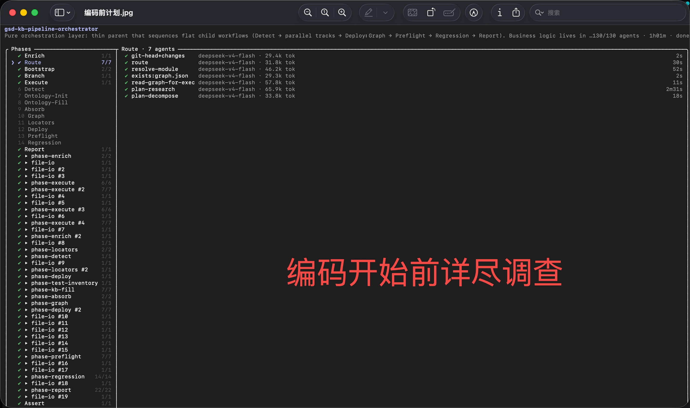 | 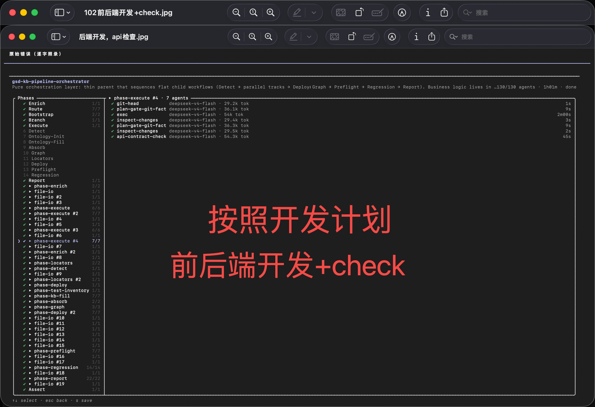 | 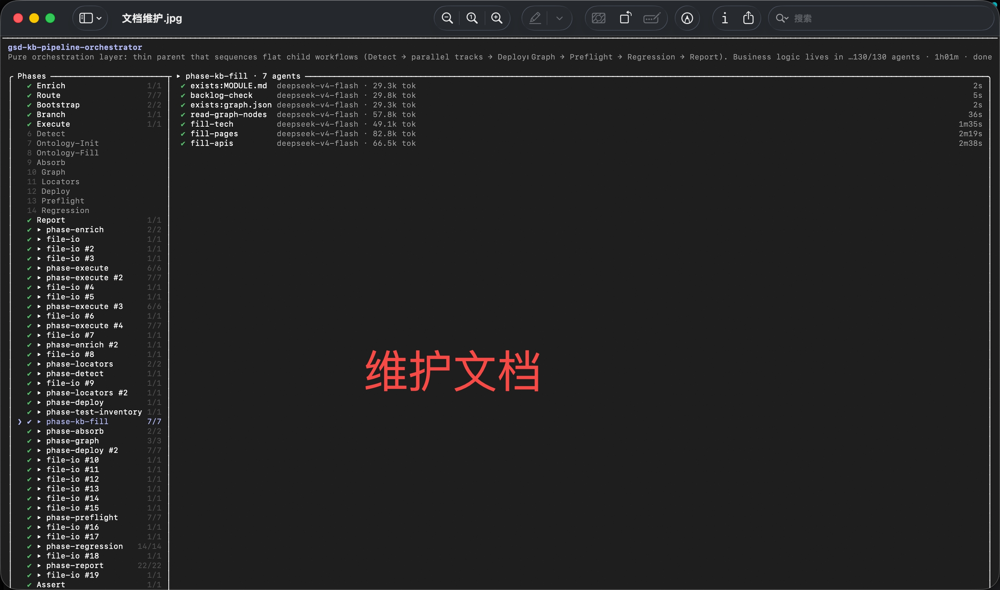 |

| ④ グラフ保守 | ⑤ 自動運用デプロイ | ⑥ スモークテスト |
|---|---|---|
| 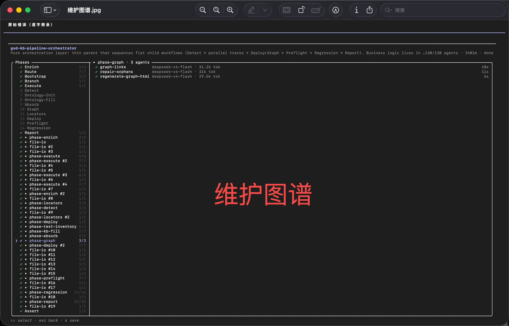 | 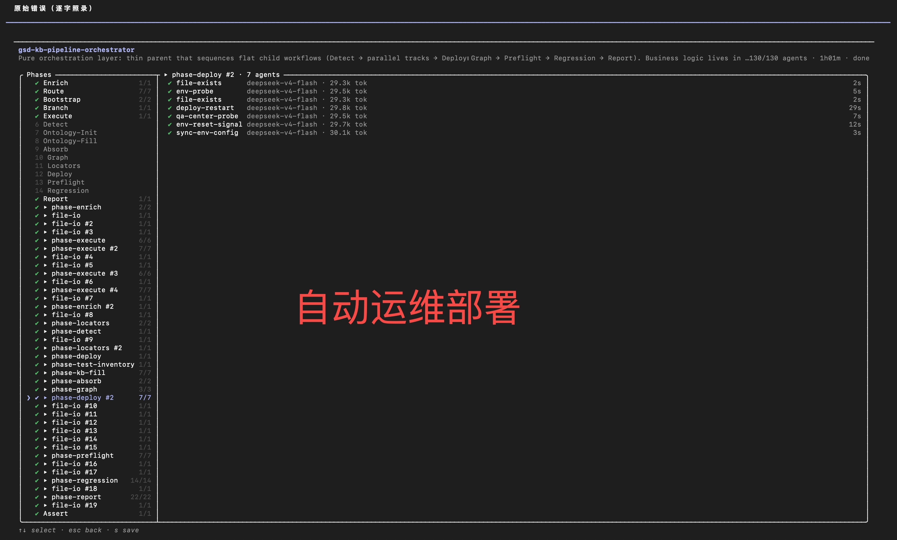 | 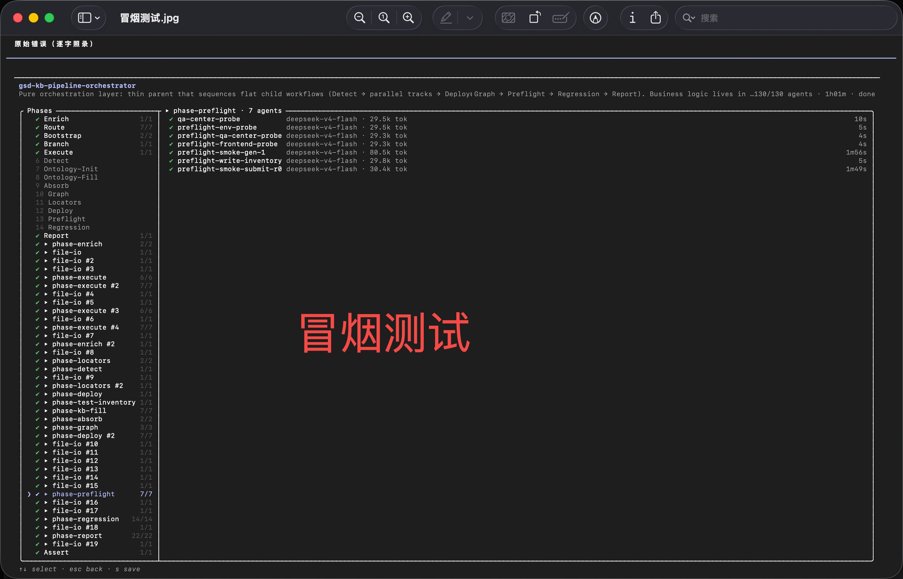 |

| ⑦ 実際の UAT テスト | ⑧ UAT テスト結果 | ⑨ 報告書の生成 |
|---|---|---|
| 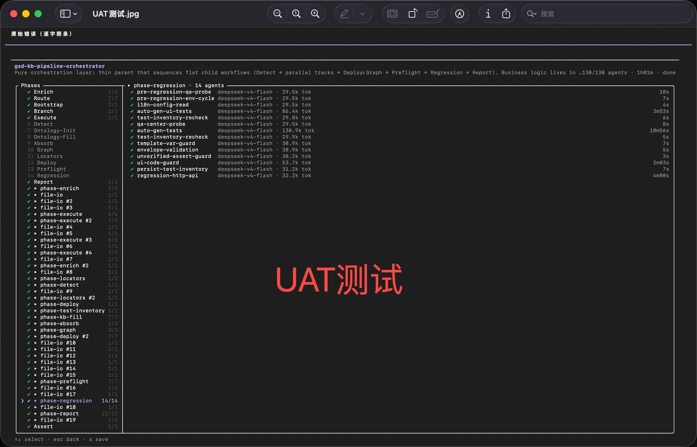 |  | 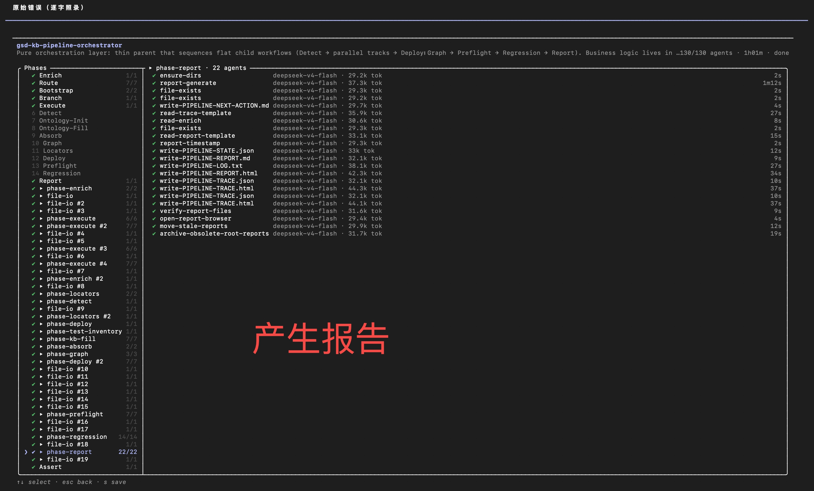 |

| ⑩ ナレッジベース + グラフ | ⑪ ドキュメントの具現化 | ⑫ 完全なレポート |
|---|---|---|
| 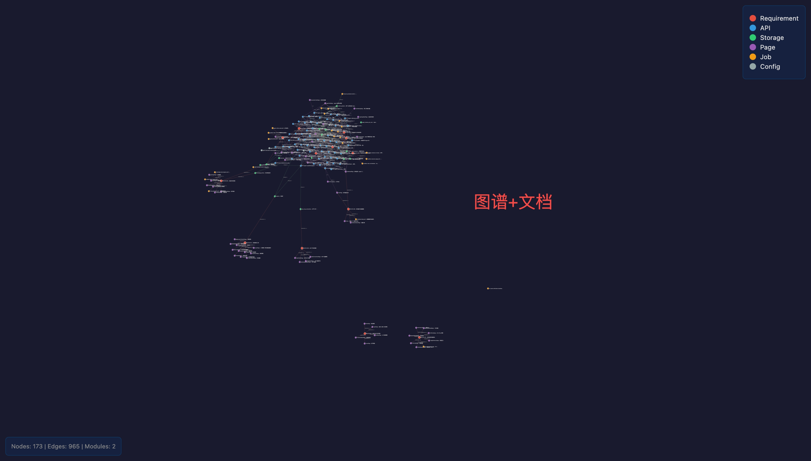 | 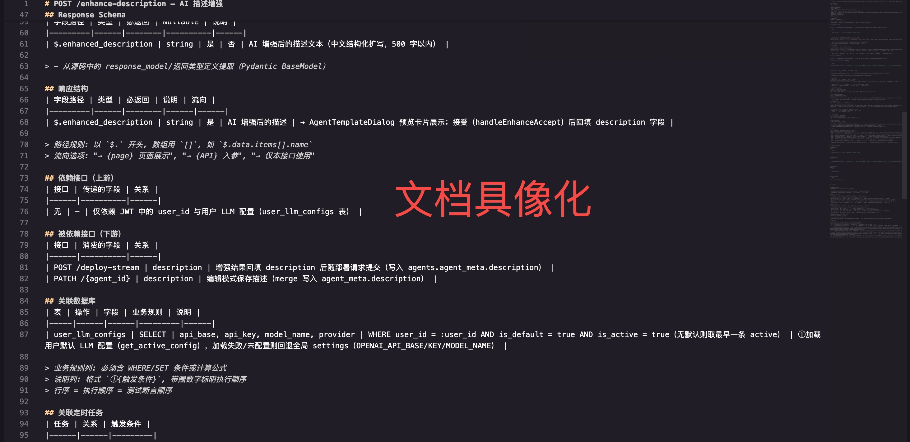 | 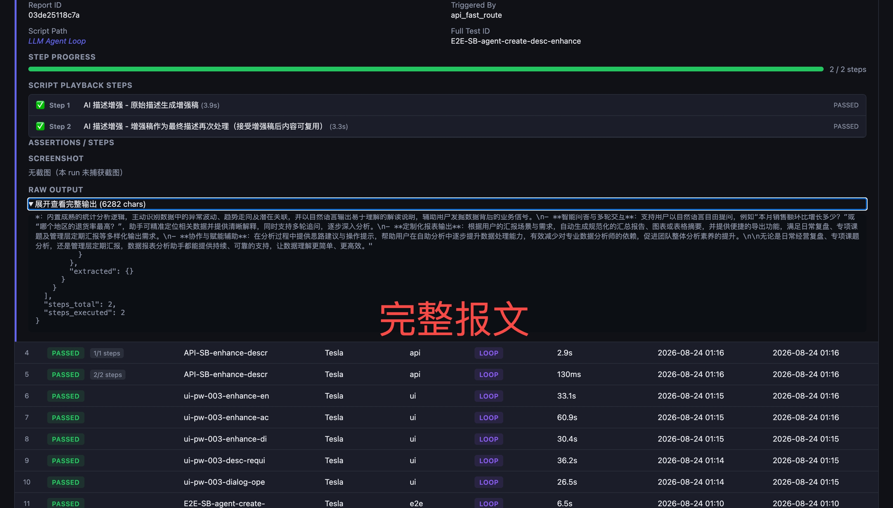 |

| ⑬ trce が証拠 | ⑭ 動画が証拠 |
|---|---|
| 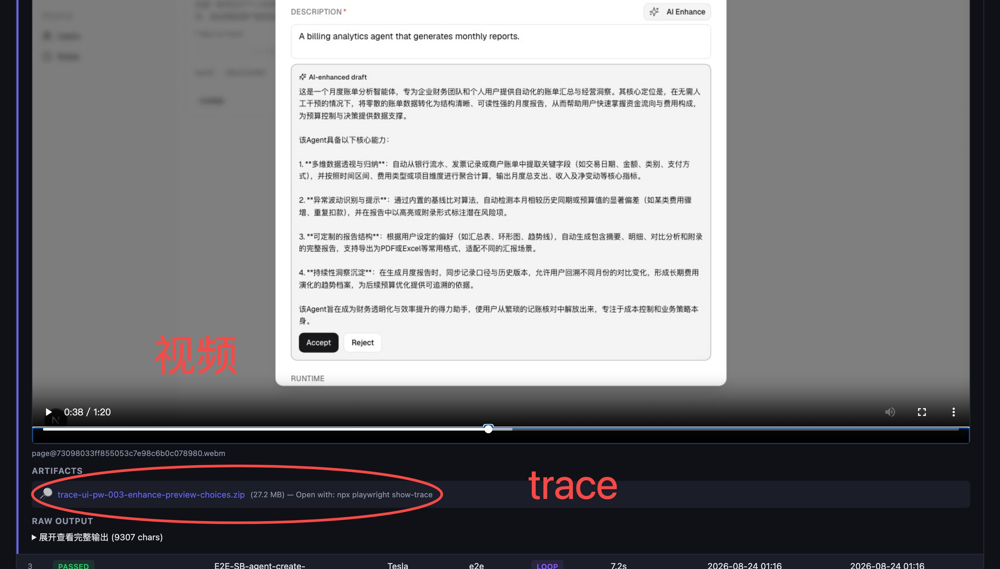 | 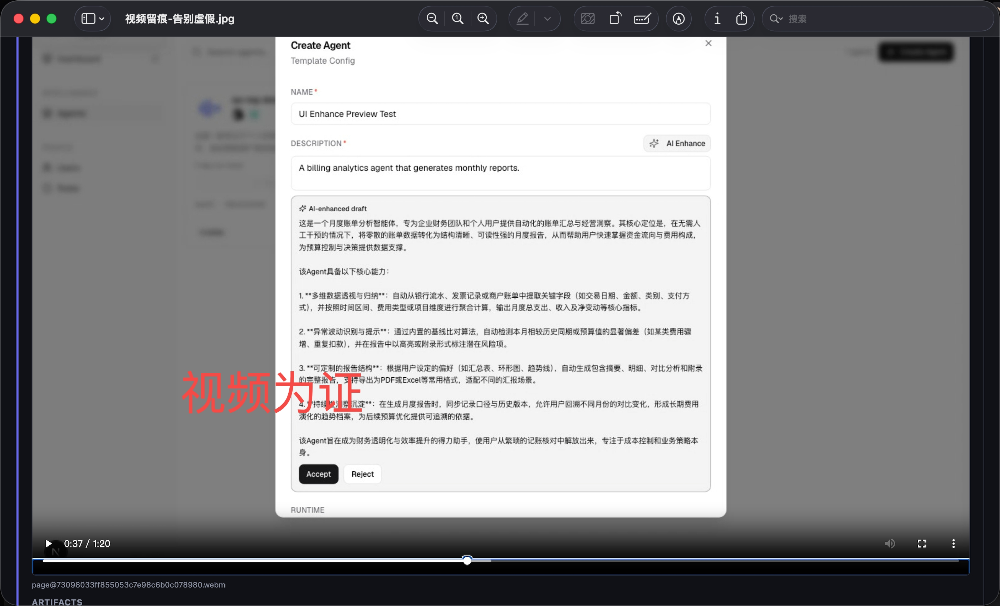 |

---

## 🧩 なぜ「車輪」だけをオープンソースにするのか?—— パズルを丸ごとここに置く

列車だけを納品したいのではなく、あえてこの層だけをオープンソースにしています:**「テスト左シフト・エンジニアリングプラットフォーム」という列車全体を一枚の完全なパズルに分解し、そのパズルの一枚一枚(車輪)をすべてここに置いています**。「要件 → 開発 → ドキュメント → グラフ → テストケース」自動化チェーンの再利用可能な部品すべて:27 個の `gsd-kb-*` skills + Python エンジン + 9 個の gsd-core(MIT)開発スキル。ひとつひとつが独立してインストール・使用できます。

> この車輪を一枚一枚組み上げてできあがるのは、上の動画で**実際に 130 個の agent · 61 分 · 全チェーン done** を完走したテスト左シフト・エンジニアリングプラットフォームです——一枚のパズルが、一台の完全な列車になる。

> パズルをすべてここに置くのは、ほかでもなく**同じ志を持つ人**を見つけるためです:「テスト左シフト・エンジニアリングプラットフォーム」という列車が見える人、そして手を動かしてパズルを一枚一枚レールに載せていこうとする人です。

> 車輪はもうみなさんの手元にあります。組み立てれば一台の完全な列車になると分かっていても、眺めるだけで手を動かさないなら——この列車は、ただあなたの前を走り去っていくしかありません 😄

**この列車がどんな姿か?** → [デモ動画](https://youtu.be/stfLoSjn8Go) + 上記の実際の動作スクリーンショット 14 枚。

> **今回の範囲**:上記のパズル(車輪)はすべて本リポジトリで提供され、単独で組み立てられます。より上流の「エンドツーエンド自動オーケストレーションとデプロイ」という機関車は、完全版プロダクトの今後のイテレーションに属します。列車全体を組みたい人は、このパズルから手を付けるのが、乗車への最短ルートです。

---

## 🎯 なぜ Fill が必要なのか?

### 痛点:従来開発の問題点

```
❌ 口頭の約束:PM が「ここにフィールドを追加して」と言う
   → 開発者は追加した
   → テスト側は知らない
   → 3 か月後には、その理由を覚えている人は誰もいない

❌ AI プロジェクトはブラックボックス:
   → AI が半年間プロジェクトを作り続けた
   → コードは動く
   → しかし、なぜそう設計したのか誰も知らない
   → メンテナンス不能で、書き直すしかない

❌ トレーサビリティが取れない:
   → 要件が変更された
   → どのインターフェースに影響するか分からない
   → どのテストに影響するか分からない
   → 全量リグレッションしかなく、時間の無駄
```

### 解決策:Fill の双方向トレーサビリティグラフ

```
要件 (REQ-xxx)
    │
    ├──→ インターフェース (API-xxx)
    │     │
    │     ├──→ データベース (Table-xxx)
    │     │     │
    │     │     └──→ フィールド単位の読み書きトレース
    │     │
    │     └──→ フロントエンド画面 (Page-xxx)
    │           │
    │           └──→ UI 要素 (data-testid)
    │
    └──→ テストポイント (TP-xxx)
         │
         ├──→ API テストケース
         ├──→ UI テストケース
         └──→ E2E テストケース
```

### Fill の真の価値

| トレース方向 | 価値 | サービス対象 |
|---------|------|----------|
| 要件 → インターフェース | この要件はどのインターフェースを実装しているのか? | 開発、テスト、PM |
| インターフェース → データベース | このインターフェースはどのテーブルを読み書きするのか? | 開発、DBA |
| インターフェース → ページ | どのページがこのインターフェースを呼び出しているのか? | フロントエンド、テスト |
| 要件 → テストポイント | この要件は何をテストすべきか? | テスト |
| 変更 → 影響 | このインターフェースを変えたら、どの要件に影響するか? | 全員 |
| テスト → 回帰 | このテストはどの要件をカバーしているか? | テスト、PM |

### なぜ Fill を中間に置くのか?

- **コーディング後**:コードがあるのでドキュメントを抽出できる
- **テスト前**:グラフがテスト範囲を決める
- **保守時**:グラフが設計判断を記録する

### 核となる価値

> **AI の実行全チェーンをトレーサブルにする。**
>
> - 要件は裏付けをもって検証できる
> - 開発はグラフを頼りに進められる
> - テストはトレースを辿って実施できる
>
> **だからこそ、中間に Fill フェーズを置くのです!**

---

## ⚖️ 誠実性の原則

テスト左シフトには、決定的な**誠実性の問題**があります:

### 2 つのテスト戦略

| 戦略 | やり方 | 初回成功率 | 説明 |
|------|------|-----------|------|
| **要件に忠実** | 言われていないことはテストしない | ~95% | 要件が明確に要求していることだけをテスト |
| **品質を追求** | 自由に発揮 | ~70% | 境界値、異常、性能などもテスト |

### なぜ要件忠実なら 95% の成功率なのか?

```markdown
# 要件:注文作成成功後は order_id を返す
✅ テスト:POST /api/orders → 200 + order_id

# 要件は未記載:並行作成はどうする?
❌ テストしない:並行衝突処理(要件で明確に要求されない限り)

# 要件は未記載:巨大な金額はどうする?
❌ テストしない:金額の境界値(要件で明確に要求されない限り)
```

### 推奨事項

- ✅ 要件が明確に要求している → 100% テスト
- ⚠️ 要件が暗に含む → 95% カバレッジ
- ❌ 要件が言っていない → テストしない(別途取り決めがない限り)

**なぜ?**
- テスト左シフトの目的は「要件が実装されたかを素早く検証する」こと
- 「コードの完璧さを追求する」ことではない
- 品質を追求するなら、追加の「品質強化」フェーズが必要

---

## 🔄 今回公開する能力 · KB エンジニアリング・ワークフロー

「要件 → コーディング → デプロイ → スモーク → UAT → 報告」という完全な自動化クローズドループは、ShiftLeft Engine の**完全版プロダクトのビジョン**です。そのオーケストレーション・パイプラインは完全版プロダクトのペースでイテレーションし、**今回は本リポジトリでは公開しません**。今回公開するのは、このクローズドループの中で最も根幹となる「ナレッジベース + グラフ + テストケース生成」のエンジニアリング層です。**27 個の `gsd-kb-*` skills** と **9 個の gsd-core(MIT)開発スキル** で構成され、すぐに実践できます:

```
┌─────────────────────────────────────────────────────────────────────────┐
│  Step 1 · KB + グラフの初期化                                           │
│  /gsd-kb-init --source <コード> --module <モジュール> --output docs/kb  │
├─────────────────────────────────────────────────────────────────────────┤
│  Step 2 · 多次元 Fill(ドキュメント + グラフ)                            │
│  /gsd-kb-fill + 14 個の fill サブスキル(10 次元ドキュメント + グラフ)   │
├─────────────────────────────────────────────────────────────────────────┤
│  Step 3 · テストケース生成(MCP-Ready JSON)                              │
│  /gsd-kb-gen-tests-{api,e2e,ui}                                         │
├─────────────────────────────────────────────────────────────────────────┤
│  Step 4 · 要素フィンガープリント注入                                    │
│  /gsd-kb-enforce-locators(data-testid 標準化)                           │
├─────────────────────────────────────────────────────────────────────────┤
│  Step 5 · クエリ · 修復 · インクリメンタル吸収                          │
│  /gsd-kb-query · /gsd-kb-repair-orphans · /gsd-kb-absorb                │
└─────────────────────────────────────────────────────────────────────────┘
```

### Step 1:初期化(init)

```
ソースコード → API/テーブル/ページ/タスクを逆スキャン → ドキュメント骨格 + グラフを生成
/gsd-kb-init --source C:/Code/your-project --module your-project --output docs/kb
```

### Step 2:多次元 Fill(fill)

```
ドキュメント骨格
    │
    ├──→ Phase 1:/gsd-kb-fill-tech      ← Python エンジン batch-fill(秒単位の AST 静的抽出)
    └──→ Phase 2:/gsd-kb-fill-ai        ← AI multi-agent オーケストレーション(分単位のディープセマンティック Fill)
          ├── 10 次元ドキュメント:requirements · apis · storage · pages · jobs
          │                       config · permissions(認証・認可)· error-handling · integration · tech
          ├── 拡張:from-prd(要件原文を取り込み、権威あるビジネスコンテキストを補完)
          └── グラフ:graph(構築 + オフライン D3 可視化)· graph-links(双方向トレースチェーンのバックフィル)
```

### Step 3:テストケース生成(gen-tests)

```
/gsd-kb-gen-tests-api    → 多ステップ連結の API 契約ケース(MCP-Ready JSON)
/gsd-kb-gen-tests-e2e    → depends_on の DAG による業務フロー / エッジシナリオ / ロールバック整合性ケース
/gsd-kb-gen-tests-ui     → data-testid ベースの UI ケース(Playwright セマンティックセレクタ)
```

テンプレート駆動:各サブスキルは `templates/{API,E2E,UI}-TEST-TEMPLATE.json` を読み込み、MCP-Ready な構造化 JSON を出力します。実行側は完全版プロダクト内で **QA マルチエージェント・オーケストレーション実行システム**が担います(受入 → クラスタ配信 → 実環境での実行 → 結果の還流)。今回のオープンソース・サブセットは「テストケース生成」のみを公開し、実行システムは同梱しません(今後のオープンソース状況を見て判断)。

### Step 4:要素フィンガープリント注入(enforce-locators)

```
フロントエンドコンポーネントをスキャン → 標準化した data-testid を注入(操作要素 + バリデーション/エラー表示要素)
→ 実際のブラウザでの UI テストを「雷のように速く、岩のように安定」に
```

### Step 5:クエリ · 修復 · 取り込み

```
/gsd-kb-query            → グラフクエリ:影響分析 / 要件トレース / ドキュメント特定、精度の高いコンテキスト
/gsd-kb-repair-orphans   → グラフの孤立リンクを修復(オーファンノード、report-only 方式の確認)
/gsd-kb-absorb           → .planning/ の成果物を KB ドキュメントへ段階的に取り込み(インクリメンタルパッチ、全体を書き換えない)
```

---

## 🏗️ アーキテクチャ設計

```
┌──────────────────────────────────────────────────────────────────────────┐
│             ShiftLeft Engine · オープンソースサブセット構成              │
├──────────────────────────────────────────────────────────────────────────┤
│  入力                                                                    │
│  ┌────────────────────┐  ┌────────────────────┐  ┌────────────────────┐  │
│  │  ソースコード      │  │  要件ドキュメント  │  │  ENV-CONFIG        │  │
│  │  (多言語コード)    │  │  (REQ-xxx)         │  │  (JSON 契約)       │  │
│  └──────────┬─────────┘  └──────────┬─────────┘  └──────────┬─────────┘  │
│             │                       │                       │            │
│             ▼                       ▼                       ▼            │
│  ┌────────────────────────────────────────────────────────────────────┐  │
│  │  SKILL 層 · 27 個の gsd-kb-*(Claude Code Skills,Markdown)          │  │
│  │  init → fill(+14 サブスキル) → gen-tests-{api,e2e,ui}              │  │
│  │  enforce-locators → query · repair-orphans · absorb                │  │
│  └─────────────────────────────────┬──────────────────────────────────┘  │
│  ┌─────────────────────────────────┴──────────────────────────────────┐  │
│  │  Python エンジン層 · knowledge-base(packages,12 サブコマンド)      │  │
│  │  サードパーティ依存ゼロ · scaffold / batch-fill / decompose /      │  │
│  │  fill / check / trace / index / graph / regression                 │  │
│  └─────────────────────────────────┬──────────────────────────────────┘  │
│  ┌─────────────────────────────────┴──────────────────────────────────┐  │
│  │  gsd-core(MIT)開発 skills · 9 個                                   │  │
│  │  quick · debug · spike · code-review · plan-phase · ...            │  │
│  └─────────────────────────────────┬──────────────────────────────────┘  │
│                                    │                                     │
│                                    ▼                                     │
│  ┌────────────────────────────────────────────────────────────────────┐  │
│  │  出力                                                              │  │
│  │  KB ドキュメント(10 次元)· graph.json + graph.html(D3)             │  │
│  │  テストケース JSON(API/UI/E2E,MCP-Ready)· ENV-CONFIG.json          │  │
│  └────────────────────────────────────────────────────────────────────┘  │
└──────────────────────────────────────────────────────────────────────────┘
```

> 完全版プロダクトの「🧠 オーケストレーション層 (Pipeline Orchestrator) + MCP Agent クラスタ」は完全版プロダクトの能力に属し、今回のリポジトリでは公開しません(デモは上記の動画、境界は「なぜ車輪だけをオープンソースにするのか」を参照)。

---

## 🎯 コア機能

| 機能 | 評価 | 説明 |
|------|------|------|
| Fill 双方向トレーサビリティグラフ | ⭐⭐⭐⭐⭐ | 10 次元ホログラフィックマッピング、要件 → インターフェース → ストレージ → ページ → テストポイントを全チェーンでトレース可能 |
| 不変の要素フィンガープリント | ⭐⭐⭐⭐⭐ | data-testid 自動注入(enforce-locators)、実際のブラウザテストを高速かつ安定に |
| テストケース生成 | ⭐⭐⭐⭐⭐ | API / UI / E2E の 3 フォーマット、テンプレート駆動、MCP-Ready JSON を直接実行可能 |
| JSON 契約 | ⭐⭐⭐⭐⭐ | ENV-CONFIG.sample.json がデプロイ → テストの標準契約を定義、下流で一貫解析 |
| グラフクエリ + 影響分析 | ⭐⭐⭐⭐⭐ | gsd-kb-query:変更影響範囲、要件トレース、ドキュメント特定を秒単位で回答 |
| オーファンリンク修復 | ⭐⭐⭐⭐☆ | graph repair-orphans が自動補完、残存する孤立ノードを調査 |
| インクリメンタル取り込み | ⭐⭐⭐⭐☆ | gsd-kb-absorb がインクリメンタルパッチ方式で取り込み、既存ドキュメントを全体書き換えしない |
| サードパーティ依存ゼロのエンジン | ⭐⭐⭐⭐⭐ | Python エンジンは 12 サブコマンド、純標準ライブラリ、一度インストールすればどこでも動作 |
| マルチスタックソース解析 | ⭐⭐⭐⭐☆ | scaffold が多言語(API/ORM/Page/Job)を逆スキャン、サブプロジェクトを自動検出 |

---

## 📦 プロダクトコンポーネント(設計。完全版プロダクトのイテレーションとともに公開)

以下 4 つのコンポーネントは、**完全版プロダクト**「ShiftLeft Engine」のコンポーネントインターフェース設計です(完全版プロダクトのイテレーションとともに公開予定で、本リポジトリでは提供していません):

- **`@shiftleft-engine/fill-graph`** — Fill 双方向グラフの型定義とクエリインターフェース(設計)
- **`@shiftleft-engine/locator-generator`** — 要素ロケータ自動注入ツール(設計)
- **`@shiftleft-engine/cli-interface`** — CLI コマンド解析と引数バリデーション仕様(設計)
- **`@shiftleft-engine/report-formatter`** — 総合レポート生成テンプレート(設計)

> 初期版 README に示されていた TypeScript コード、npm パッケージインターフェース、`shiftleft-engine` コマンドライン用法は、いずれも完全版プロダクトの設計稿です(製品のペースに合わせて今後のバージョンで公開)——本リポジトリで実際に使える能力は下の「クイックスタート」をご覧ください。

---

## 🚀 クイックスタート

### インストール

```bash
git clone <リポジトリURL>
cd <リポジトリ>
bash install-kb.sh  # リリースリポジトリ直下で直接実行; ソースクローン内では bash release/install-kb.sh または bash scripts/install-kb.sh
```

- デフォルトは **copy** モード(安全。リポジトリを移動してもリンク切れが起きない);`--link` はシンボリックリンク(開発モード。ソース変更が即反映);`--target` で対象ディレクトリを変更可能
- インストール内容:`gsd-kb-*` skills + 9 個の gsd-core(MIT)開発 skills → `~/.claude/skills`;gsd-core エンジン → `~/.claude/gsd-core`;Python エンジン → `~/.claude/knowledge-base`
- 配置場所:27 個の `gsd-kb-*` はリポジトリ直下 `skills/`;9 個の gsd-core(MIT)開発スキルはリリースパッケージに同梱(ソースクローンでは `release/release-skills/`、リリースパッケージ直下では `release-skills/`)——リポジトリ直下 `skills/` には 27 個の `gsd-kb-*` のみ。完全な境界は `release/PACKAGE.md` を参照

**インストール後に Claude Code を再起動すれば**、`/gsd-kb-*` スラッシュコマンドが使えます。

> 本プロジェクトは初めてのオープンソース化です。インストールや使用中に問題があればぜひフィードバック(issue)をお寄せください。できるだけ早く対応します。

### 最小の動作パス(init → fill-ai → gen-tests-e2e)

```bash
# 1. KB + グラフを初期化(逆スキャンでドキュメント骨格を生成)
/gsd-kb-init --source C:/Code/your-project --module your-project --output docs/kb

# 2. AI マルチエージェントによる深層 Fill(10 次元ドキュメント + グラフ)
/gsd-kb-fill-ai --module your-project --source C:/Code/your-project/backend \
                --frontend C:/Code/your-project/frontend --output docs/kb

# 3. MCP-Ready E2E テストケースを生成
/gsd-kb-gen-tests-e2e --module your-project --output docs/kb
```

### Python エンジン

```bash
cd knowledge-base         # リリースリポジトリ直下; ソースクローン内では cd release/knowledge-base
python3 -m packages.cli --help    # 12 サブコマンド:decompose / fill / check / trace /
                                  # scaffold / batch-fill / graph / index / regression / ...
```

### ENV-CONFIG 契約

デプロイ → テストの JSON 契約サンプルは [`samples/ENV-CONFIG.sample.json`](samples/ENV-CONFIG.sample.json) を参照。完全な公開物の境界は [`PACKAGE.md`](PACKAGE.md) を参照(ソースクローン内では `release/PACKAGE.md`)。

---

## 📐 技術スタック

- **エンジン言語**:Python 3(サードパーティ依存ゼロ、純標準ライブラリ)
- **Skill 層**:Claude Code Skills(Markdown 指示 + テンプレート)
- **データ契約**:JSON(ENV-CONFIG / テストケース / graph.json)
- **グラフ可視化**:D3.js(オフライン、graph.html はインタラクティブな力指向グラフ)
- **インストーラ**:bash(install-kb.sh、オープンソースですぐインストール)

---

## 🤝 コントリビューションガイド

コントリビューション歓迎!まず [`release/PACKAGE.md`](release/PACKAGE.md) を読んで、オープンソース公開物の境界をご確認ください。

### 開発環境

```bash
# リポジトリをクローン(公開時に実際のリポジトリ URL を記入)
git clone git@github.com:<your-org>/<repo>.git

# 二重コピーの同期(重要!)
# skills/ がソース、release/skills/ が公開用コピー —— skill を変更する際は両方を同期すること。
# そうしないと公開物とソースが不一致になる(リポジトリの skills と ~/.claude のグローバルコピーも同様)

# Python エンジンは knowledge-base/ 直下で直接実行
cd knowledge-base
python3 -m packages.cli --help
```

---

## 📄 ライセンス

本プロジェクトは [Apache License 2.0](LICENSE) ライセンスを採用しています。

**なぜ Apache-2.0 を選ぶのか?**
- ゆるいライセンスで、採用率とコミュニティへの普及を最大化
- 特許許諾と商標保護条項を含み、コントリビューターの権益にも配慮
- 本プロジェクトに影響を与えた gsd-core(MIT)ライセンスと互換性があり、帰属表示を維持可能

> 本プロジェクトには [gsd-core](https://github.com/open-gsd/gsd-core)(MIT License)から派生した内容が含まれます。詳細は [NOTICE](NOTICE) をご覧ください。

---

## 📊 プロジェクト統計

- **Skills**:27 個の `gsd-kb-*`(うち 14 個は fill サブスキルで、10 次元ドキュメント + グラフをカバー)
- **Python エンジン**:12 サブコマンド、サードパーティ依存ゼロ
- **ナレッジグラフ**:10 次元双方向トレーサビリティ + オフライン D3 可視化
- **テストケース**:3 フォーマット生成(API / UI / E2E)、MCP-Ready JSON
- **開発スキル**:9 個の gsd-core(MIT)開発スキルを内蔵

---

## 🔗 関連リンク

- [デモ動画](https://youtu.be/stfLoSjn8Go)
- [オープンソース公開物の説明](release/PACKAGE.md)

---

## 🙏 謝辞

### 着想の源

本プロジェクトのアーキテクチャ設計と一部のツール関数は、以下の優れたオープンソースプロジェクトから着想を得ています:

- **[GSD Core](https://github.com/open-gsd/gsd-core)** - メタプロンプト、コンテキストエンジニアリング、仕様駆動開発システム
  - 本プロジェクトのナレッジグラフクエリ、ドキュメント生成などの機能は GSD Core に触発されています
  - 開発側 skills(gsd-quick / gsd-debug / gsd-spike / gsd-code-review / gsd-plan-phase など 9 個)は gsd-core から直接組み込まれています
  - GSD Core は MIT ライセンスを採用しており、本プロジェクトから心からの感謝を表します

### 技術スタックへの謝辞

以下のオープンソースプロジェクトに感謝します:
- [Python](https://www.python.org/)
- [D3.js](https://d3js.org/)
- [Claude Code](https://claude.com/claude-code)
- [Bash](https://www.gnu.org/software/bash/)

---

## 🗺️ ロードマップ

### 完了済み

- ✅ 要件駆動の KB エンジニアリングパイプライン(gsd-kb-init → fill → graph)
- ✅ Fill 双方向トレーサビリティグラフ(10 次元 + オフライン D3 可視化)
- ✅ グラフ可視化(graph.html インタラクティブ力指向グラフ)
- ✅ 不変の要素フィンガープリント(data-testid 注入、enforce-locators)
- ✅ API / UI / E2E テストケース生成(MCP-Ready JSON)
- ✅ AI による修復支援(スモーク / UAT 失敗時の自動修復)
- ✅ Python エンジン 12 サブコマンド(サードパーティ依存ゼロ)
- ✅ ワンクリックインストーラ(install-kb.sh)

### 進行中

- 🔄 テストカバレッジ分析(coverage を深化)

### 計画中

- 📋 QA マルチエージェント・オーケストレーション実行システム(テスト左シフトの実行側。今後のオープンソース状況を見て決定)
- 📋 npm で `@shiftleft-engine` コンポーネントを配布(オープンソースサブセット → 独立パッケージ)
- 📋 多言語対応
- 📋 将来的に:UAT 通過後にもう 1 ラウンド UAT を追加し、失敗時は 2 回目の修復ループ
- 📋 性能テスト統合(K6)
- 📋 モバイル App 開発サポート(Phase 2)
- 📋 複数人でのコラボレーションモード

### 将来ビジョン(Phase 2)

> **このパターンを App 開発レイヤーに応用**
>
> - 要件 → コーディング → テスト → リリース の完全クローズドループを実現
> - iOS/Android/Flutter などクロスプラットフォーム開発をサポート
> - CI/CD パイプラインを統合
> - 複数チームのコラボレーションをサポート

---

## 💬 連絡先

- **メール**: wanglikai201101@gmail.com
- **GitHub**: [@wanglikai201101-ctrl](https://github.com/wanglikai201101-ctrl)

---

## 📌 著作権表示

**© 2026 ShiftLeft Engine · Licensed under the Apache License 2.0**

*本リポジトリは個人の独立プロジェクトであり、いかなる企業の営業秘密も含まれません。*

*GSD Core から着想を得てアーキテクチャを設計しました。原作者のオープンソースへの貢献に感謝します。*